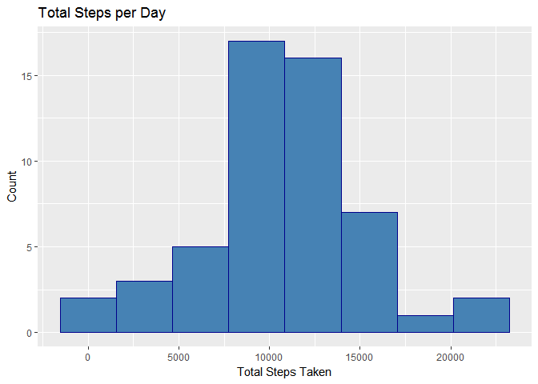
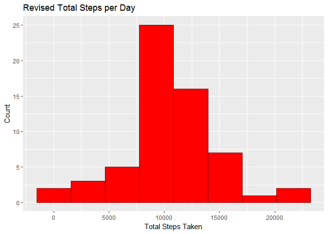

# Reproducible Research: Peer Assessment 1

#RepData_PeerAssessment1
##JHU - Reproducible Research
###Ray lugo, Jr.
Purpose:  To create a literate program that will document the method used for data processing, analysis and visualization, provided in a form through which the research can be easily reproduced.

##Prepare environment: Load libraries, load data.

```r
library(tidyverse)
```

```
## Loading tidyverse: ggplot2
## Loading tidyverse: tibble
## Loading tidyverse: tidyr
## Loading tidyverse: readr
## Loading tidyverse: purrr
## Loading tidyverse: dplyr
```

```
## Conflicts with tidy packages ----------------------------------------------
```

```
## filter(): dplyr, stats
## lag():    dplyr, stats
```

```r
library(lubridate)
```

```
## 
## Attaching package: 'lubridate'
```

```
## The following object is masked from 'package:base':
## 
##     date
```

```r
library(lattice)
library(knitr)
library(xtable)

#load data from zip
activity_data <- readr::read_csv(file = "data/activity.zip", col_names = TRUE, col_types = readr::cols(readr::col_integer(),readr::col_date(format = "%Y-%m-%d"),readr::col_integer()))
```

##Question 1: What is mean total number of steps taken per day?
Make a data.frame for total number of steps per day (excluding NA.)

```r
activity_data_no_NA <- filter(activity_data,!is.na(activity_data$steps))
total_steps_per_day <- activity_data_no_NA %>%
    select(date, steps) %>%
    group_by(date) %>%
    summarise(totalSteps = sum(steps))
xtable(summary(total_steps_per_day))
```

```
## % latex table generated in R 3.3.2 by xtable 1.8-2 package
## % Sun Feb 12 12:03:51 2017
## \begin{table}[ht]
## \centering
## \begin{tabular}{rll}
##   \hline
##  &      date &   totalSteps \\ 
##   \hline
## 1 & Min.   :2012-10-02   & Min.   :   41   \\ 
##   2 & 1st Qu.:2012-10-16   & 1st Qu.: 8841   \\ 
##   3 & Median :2012-10-29   & Median :10765   \\ 
##   4 & Mean   :2012-10-30   & Mean   :10766   \\ 
##   5 & 3rd Qu.:2012-11-16   & 3rd Qu.:13294   \\ 
##   6 & Max.   :2012-11-29   & Max.   :21194   \\ 
##    \hline
## \end{tabular}
## \end{table}
```
Plot histogram of steps per day. 

```r
plot_histogram_total_steps_per_day <- ggplot(data = total_steps_per_day, aes(x = totalSteps)) +
    geom_histogram(stat = "bin", bins = 5, binwidth = 5000, color = "darkblue", fill = "steelblue") +
    labs(title = "Total Steps per Day", x = "Total Steps Taken", y = "Count") +
    ggsave(filename = "figures/histogram_total_steps_per_day.png", width = 5, height = 3)

plot_histogram_total_steps_per_day
```

<!-- -->

calculate the mean value of total steps

```r
meanTotalSteps <- mean(total_steps_per_day$totalSteps)
print(paste("Mean total steps per day:", meanTotalSteps))
```

```
## [1] "Mean total steps per day: 10766.1886792453"
```

```r
###calculate the mid value of total steps
midTotalSteps <- median(total_steps_per_day$totalSteps)
print(paste("Median total steps per day:", midTotalSteps))
```

```
## [1] "Median total steps per day: 10765"
```

##Question 2: What is the average daily activity pattern?
Make a data.frame for mean steps taken per interval across all days

```r
mean_steps_per_interval_all_days <- activity_data_no_NA %>%
    select(interval, steps) %>%
    group_by(interval) %>%
    summarise(meanSteps = mean(steps))
xtable(summary(mean_steps_per_interval_all_days))
```

```
## % latex table generated in R 3.3.2 by xtable 1.8-2 package
## % Sun Feb 12 12:03:52 2017
## \begin{table}[ht]
## \centering
## \begin{tabular}{rll}
##   \hline
##  &    interval &   meanSteps \\ 
##   \hline
## 1 & Min.   :   0.0   & Min.   :  0.000   \\ 
##   2 & 1st Qu.: 588.8   & 1st Qu.:  2.486   \\ 
##   3 & Median :1177.5   & Median : 34.113   \\ 
##   4 & Mean   :1177.5   & Mean   : 37.383   \\ 
##   5 & 3rd Qu.:1766.2   & 3rd Qu.: 52.835   \\ 
##   6 & Max.   :2355.0   & Max.   :206.170   \\ 
##    \hline
## \end{tabular}
## \end{table}
```

Plot meanSteps by interval in time series plot

```r
plot_time_series_mean_steps_per_interval <- ggplot(data = mean_steps_per_interval_all_days, aes(interval, meanSteps)) +
    geom_step(color = 'blue', lwd = 0.25) +
    scale_x_continuous(breaks = c(seq(0,2500,250)),minor_breaks = c(seq(0,2500,50))) +
    theme_bw() +
    labs(title = "Average Total Steps per Interval", x = "Interval", y = "Average Total Steps") +
    ggsave(filename = "figures/time_series_mean_steps_per_interval.png", width = 5, height = 3)

plot_time_series_mean_steps_per_interval
```

<!-- -->

Find the interval with the max average steps per day

```r
interval_max_steps = mean_steps_per_interval_all_days %>%
    select(interval, meanSteps) %>%
    filter(meanSteps == max(meanSteps))

print(paste("Interval #",interval_max_steps$interval,"has the max average steps per day of", interval_max_steps$meanSteps))
```

```
## [1] "Interval # 835 has the max average steps per day of 206.169811320755"
```

plot vline at interval with max steps

```r
plot_time_series_interval_max_steps = plot_time_series_mean_steps_per_interval +
    geom_vline(xintercept = interval_max_steps$interval, color = "red", lwd = 0.1, linetype = "longdash") +
    geom_point(x = interval_max_steps$interval, y = interval_max_steps$meanSteps, pch = 21, size = 0.5, color = "red") +
    labs(title = "Average Total Steps per Interval ", x = "Interval", y = "Average Total Steps") +
    geom_text(aes(x  = interval_max_steps$interval, y = 0), nudge_x = 200, size = 2, label = paste("Interval: ",interval_max_steps$interval), color = "red") +
    geom_text(aes(x  = interval_max_steps$interval, y = interval_max_steps$meanSteps), nudge_x = 200, size = 2, label = paste("Max:", round(interval_max_steps$meanSteps,2)), color = "red") +
    ggsave(filename = "figures/time_series_interval_max_steps.png", width = 5, height = 3)

plot_time_series_interval_max_steps
```

<!-- -->

##Question 3: Imputing missing values
Calculate and report the number of missing values

```r
missing_activity_data <- filter(activity_data,is.na(activity_data$steps))
print(paste("Number of Observations missing data:", count(missing_activity_data)))
```

```
## [1] "Number of Observations missing data: 2304"
```

Devise strategy to replace NA values with average steps value for each corresponding interval.

```r
imputed_activity_data <- inner_join(missing_activity_data, mean_steps_per_interval_all_days, by = "interval") %>%
    select(steps = meanSteps, date,interval)
```

Create new dataset that contains original with replaced NA observations.

```r
revised_activity_data <- rbind(activity_data_no_NA, imputed_activity_data)
```

Make a histogram of the total number of steps taken each day using new dataset.

```r
revised_total_steps_per_day <- revised_activity_data %>%
    select(date, steps) %>%
    group_by(date) %>%
    summarise(totalSteps = sum(steps))
```

Plot histogram of steps per day.

```r
plot_histogram_revised_total_steps_per_day <- ggplot(data = revised_total_steps_per_day, aes(totalSteps)) +
    geom_histogram(stat = "bin", bins = 5, binwidth = 5000, color = "darkred", fill = "red") +
    labs(title = "Revised Total Steps per Day", x = "Total Steps Taken", y = "Count") +
    ggsave(filename = "figures/histogram_revised_total_steps_per_day.png", width = 5, height = 3)

plot_histogram_revised_total_steps_per_day
```

<!-- -->

calculate the mean value of total steps

```r
revisedMeanTotalSteps <- mean(revised_total_steps_per_day$totalSteps)
print(paste("Revised Mean total steps per day:", revisedMeanTotalSteps))
```

```
## [1] "Revised Mean total steps per day: 10766.1886792453"
```

calculate the mid value of total steps

```r
revisedMidTotalSteps <- median(revised_total_steps_per_day$totalSteps)
print(paste("Revised Median total steps per day:", revisedMidTotalSteps))
```

```
## [1] "Revised Median total steps per day: 10766.1886792453"
```

Do the values differ from the original mean and mid?
Yes, the Median and the Mean are equal which means this is a symmetric distribution.

What is the impact of imputing missing data on the estimates of the total daily number of steps?
Calculating Mode to test a hunch


```r
#getmode function was found here https://www.tutorialspoint.com/r/r_mean_median_mode.htm
getmode <- function(v) {
    uniqv <- unique(v)
    uniqv[which.max(tabulate(match(v, uniqv)))]
}

revisedMode <- getmode(revised_total_steps_per_day$totalSteps)
print(paste("Revised Mode of averaged total steps per day:", revisedMode))
```

```
## [1] "Revised Mode of averaged total steps per day: 10766.1886792453"
```

The mid value is now equal to the mean value, so the slight skewness that was present initially has been corrected by replacing the missing values with the average total daily steps at each interval.
Furthermore, the Mode = Median = Mean, which meets the criteria for a perfect normal distribution.
With a normal distribution of interval data, the mean is usually the best measure of central tendency and is why we are using it for our calculatons.


Question #4: Are there differences in activity patterns between weekdays and weekends?

Create vectorized function to determine day of week using date and function "weekdays()" then return either "weekday" or "weekend".

```r
determineDayType <- function(x) {
    dayOfWeek <- weekdays(x, FALSE)
    ifelse(is.element(dayOfWeek,c("Saturday","Sunday")),return("weekend"),return("weekday"))
}

vdetermineDayType <- Vectorize(determineDayType)
head(vdetermineDayType)
```

```
##                                                                       
## 1 function (x)                                                        
## 2 {                                                                   
## 3     args <- lapply(as.list(match.call())[-1L], eval, parent.frame())
## 4     names <- if (is.null(names(args)))                              
## 5         character(length(args))                                     
## 6     else names(args)
```

Create and populate a new column in a new dataset with the revised data and the results of vdetermineDayType(date).

```r
dayType_activity_data <- mutate(revised_activity_data, dayType = vdetermineDayType(revised_activity_data$date))

### make the column a factor with 2 levels.
dayType_activity_data$dayType <- as.factor(dayType_activity_data$dayType)
```


```r
### Calculate average steps by dayType and interval
dayType_Mean_Total_Steps_by_Interval <- dayType_activity_data %>%
    group_by(dayType, interval) %>%
    summarise(meanSteps = mean(steps))
```

Plot using "lattice" to match example

```r
time_series_mean_steps_interval_dayType <-  xyplot(meanSteps ~ interval|dayType, data = dayType_Mean_Total_Steps_by_Interval, type = "l", layout = c(1,2), xlab = "Interval", ylab = "Average Total Steps", main = "Average Total Steps per Interval by Day Type")
#plot(time_series_mean_steps_interval_dayType)
#note: lattice can only save to the current working directory (unless I missed something), so added steps to change to "figures" dir and then back.
time_series_mean_steps_interval_dayType
```

<!-- -->
